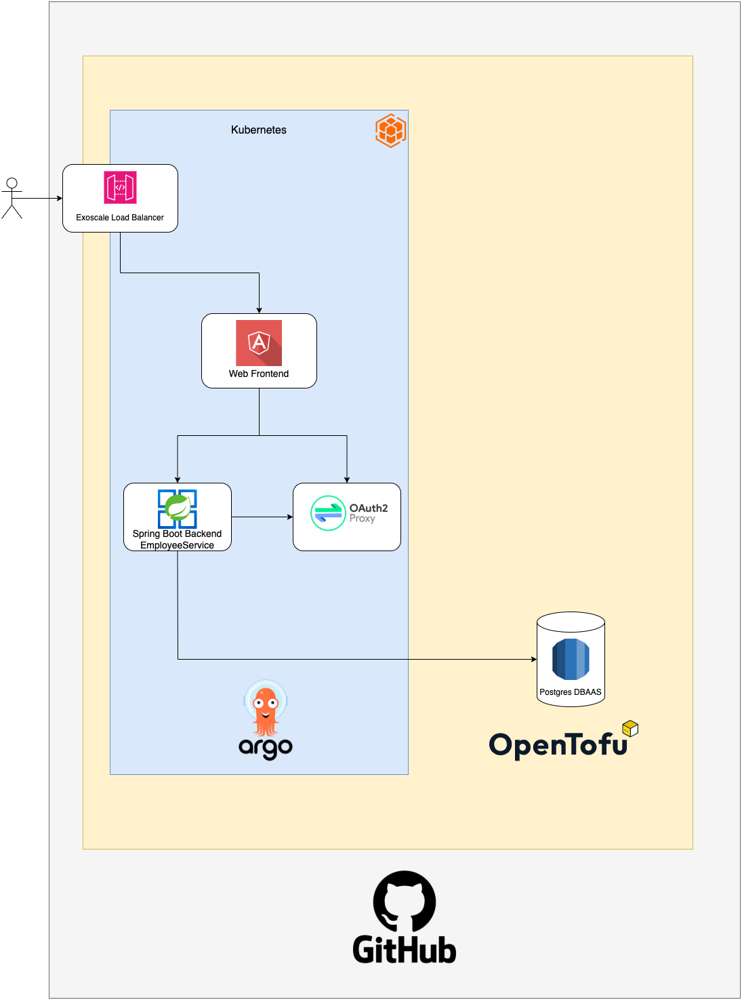

# Inhaltsverzeichnis

1. [Mitwirkende](#mitwirkende)
2. [Einleitung und Übersicht](#einleitung-und-übersicht)
    - [Features](#features)
        - [Mandantenfähigkeit](#mandantenfähigkeit)
        - [Time to Market](#time-to-market)
        - [Verwaltung der Infrastruktur](#verwaltung-der-infrastruktur)
3. [Technische Realisierung & Deployment](#technische-realisierung-und-deployment)
    - [Architekturdiagramm](#architekturdiagramm)
    - [Pipelineabbildung](#pipelineabbildung)
    - [Technologiestack](#technologiestack)
    - [Verwendung](#verwendung)
        - [Voraussetzungen](#voraussetzungen)
        - [Starten der Pipeline](#starten-der-pipeline)
        - [Testen der Applikation](#testen-der-applikation)
        - [Deployen einer neuen Instanz](#deployen-einer-neuen-instanz)
4. [Stärken und Schwächen unseres Projekts](#stärken-und-schwächen-unseres-projekts)
    - [Stärken](#stärken)
    - [Schwächen](#schwächen)

## Mitwirkende

| **Name** | **Hauptwirkungsbereiche in dem Projekt** |
|:----------:|:----------:|
| **Marco Nika**   | Backend-Entwicklung, Frontend-Entwicklung, IaC, Kubernetes, Multi-Tenancy  |
| **Rene Glavanovits**   | IaC, Automatisierung, Kubernetes, Multi-Tenancy   |

## Einleitung und Übersicht

Mit unserem Projekt realisieren wir eine Mitarbeiterverwaltung, die das Anlegen, Bearbeiten und Entfernen von Mitarbeitern ermöglicht. Dank einer skalierbaren Architektur bleibt die Plattform flexibel und leistungsstark – auch bei wachsenden Anforderungen.

### Features

#### Mandantenfähigkeit

Die Applikation wird innerhalb des Kubernetes-Clusters so aufgebaut, dass sie mithilfe eines Helm Charts beliebig oft auf demselben Cluster deployed werden kann. Dabei wird sichergestellt, dass die Daten jedes Mandanten strikt voneinander getrennt sind. Dazu wird für jeden Mandanten ein eigener Datenkservice angelegt (siehe Bild).

#### Time to Market

Das gesamte Ökosystem dieser Applikation wurde so konzipiert, dass Sie bereits innerhalb von fünf Minuten nach Vertragsabschluss über eine eigene, sichere Instanz unserer Anwendung verfügen können. Neue Versionen unserer Applikation lassen sich dank des dynamischen Aufbaus innerhalb weniger Minuten auf Ihre Instanz ausrollen.

#### Verwaltung der Infrastruktur

Der Status der gesamten Infrastruktur wird als Code verwaltet, was selbst bei einem Ausfall ganzer Regionen eine schnelle Wiederherstellung ermöglicht. Das dafür eingesetzte Tool Opentofu speichert den aktuellen Zustand in einer Datei namens "terraform.tfstate", die sicher remote bei einem Cloud-Provider in einem S3 Bucket abgelegt wird.

## Technische Realisierung und Deployment

### Architekturdiagramm

 

### Pipelineabbildung

Buildpipeline:

New Tenant Pipeline:

### Technologiestack

Für die Realisierung unseres Projekts kamen zahlreiche moderne Technologien und Werkzeuge zum Einsatz. Nachfolgend eine Übersicht der verwendeten Technologien:

| **Kategorie** | **angewandte Technologie** |
|:----------:|:--------------------------:|
| **Versionierung**   |            Git             |
| **CI/CD**   |       Github Actions       |
| **Programmiersprachen**   |      Java, TypeScript      |
| **Framework**   |    SpringBoot, Angular     |
| **Infrastrukturbereitstellung**   |          Opentofu          |
| **Cloud-Provider**   |          Exoscale          |
| **Orchistrierugstool**   |         Kubernetes         |
| **Container Runtime**   |           Docker           |
| **Applikationsdeployment**   |            Helm            |
| **Authentifizierungsmethode**   |           OAuth2           |
| **Authentifizierungsprovider**   |           GitHub           |
| **Container Registry**   |           GitHub           |

### Verwendung

Um die Mitarbeiterverwaltung erfolgreich zu nutzen, müssen bestimmte Voraussetzungen erfüllt und spezifische Schritte für Konfiguration und Betrieb beachtet werden. In diesem Kapitel wird erläutert, wie die Applikation eingesetzt wird, welche Anforderungen dabei zu berücksichtigen sind und wie sie getestet werden kann.

#### Voraussetzungen

Damit die Applikation in der eigenen Umgebung deployed werden kann, benötigt sie einige Informationen, die in Form von Secrets bereitgestellt werden müssen. Diese müssen in Github hinterlegt werden.
| **Secret Name** | **Verwendungszweck** |
|:----------:|:----------:|
| **EXOSCALE_API_KEY**   |   Exoscale-Zugang für Pipeline   |
| **EXOSCALE_API_SECRET**   |   Exoscale-Zugang für Pipeline   |

#### Starten der Pipeline

Sobald die Voraussetzungen erfüllt sind, kann der Ausrollungsprozess entweder durch einen Push auf den Main-Branch oder manuell über workflow_dispatch in der Build-Pipeline gestartet werden. Unsere Architektur ist so aufgebaut, dass zunächst immer ein Build durchgeführt wird, bevor anschließend automatisch die Deployment-Pipeline auf Exoscale gestartet wird.

#### Testen der Applikation

- Nachdem die beiden Pipelines erfolgreich ausgeführt wurden, in Exoscale unter dem Reiter Loadbalancers die IP-Adresse des automatischen Loadbalancers ausfindig machen.
- Aufruf der IP im Browser
- Mitarbeiter hinzufügen, löschen oder bestehende bearbeiten

#### Deployen einer neuen Instanz

Möchte man einen neuen Mandanten anlegen, so kann die Github-Action "New Tenant Setup" verwendet. Dabei wird man aufgefordert einen Namen für den neuen Mandanten zu vergeben. Diese Action erzeugt die relevanten Dateien auf einem Feature-Branch und erstellt einen Pull-Request. Durch manuelles mergen des Pull-Requests wird die Build-Pipeline angestoßen.

## Stärken und Schwächen unseres Projekts

### Stärken

- Vollautomatischer Ablauf, sobald die Voraussetzungen erfüllt sind
- Anbindung an eine externe Datenbank (Erstellung und Anbindung sind vollständig automatisiert)
- Keine Passwörter im Klartext sichtbar: Alle benötigten Passwörter werden in GitHub Secrets gespeichert und ausschließlich von dort im Code referenziert.
- Der Remote State von Opentofu wird in einem Exoscale S3 Bucket persitiert.

### Schwächen

- Eine OAuth-basierte Authentifizierung wurde bislang nicht integriert.